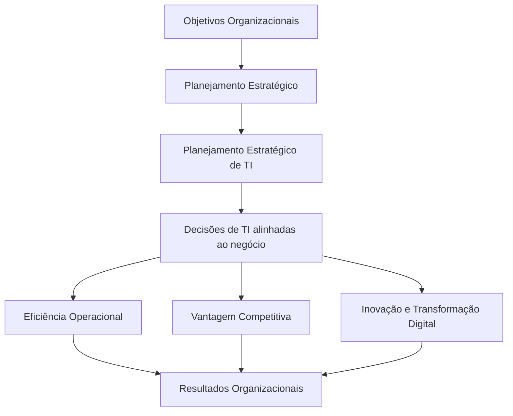
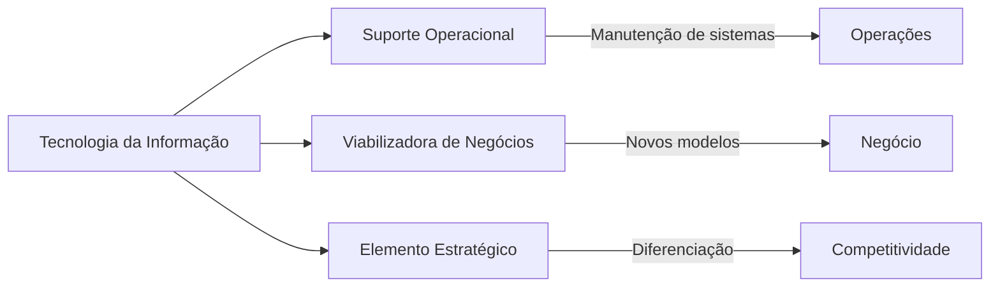

# 📊 Diagrama — Aula 01: Contextualização do Planejamento Estratégico de TI

## Relação entre TI e Estratégia Organizacional

```mermaid
flowchart TD
    A[Objetivos Organizacionais] --> B[Planejamento Estratégico]
    B --> C[Planejamento Estratégico de TI]
    C --> D[Decisões de TI alinhadas ao negócio]
    D --> E[Eficiência Operacional]
    D --> F[Vantagem Competitiva]
    D --> G[Inovação e Transformação Digital]
    E --> H[Resultados Organizacionais]
    F --> H
    G --> H
```

## Papel da TI nas Organizações

```mermaid
graph LR
    TI[Tecnologia da Informação]
    TI --> SUP[Suporte Operacional]
    TI --> VIA[Viabilizadora de Negócios]
    TI --> EST[Elemento Estratégico]
    SUP --> |Manutenção de sistemas| OP[Operações]
    VIA --> |Novos modelos| NEG[Negócio]
    EST --> |Diferenciação| COMP[Competitividade]
```
