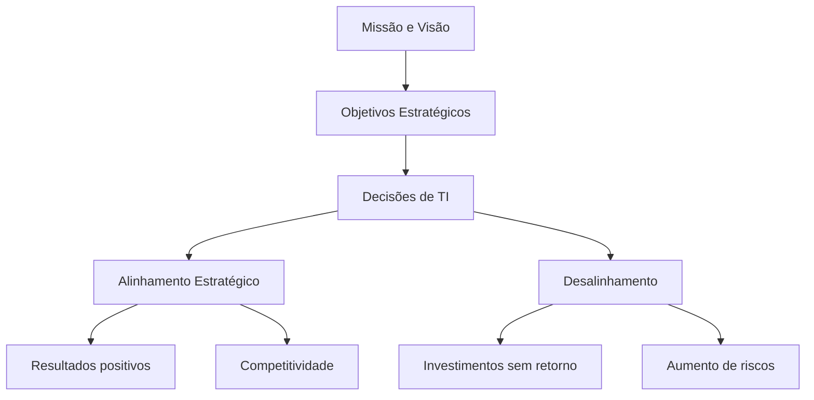
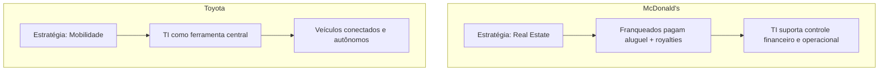

# 📊 Diagrama — Aula 02: TI e Estratégia Organizacional

## Alinhamento entre TI e Estratégia

```mermaid
flowchart TD
    MIS[Missão e Visão] --> OBJ[Objetivos Estratégicos]
    OBJ --> DEC[Decisões de TI]
    DEC --> ALI[Alinhamento Estratégico]
    DEC --> DES[Desalinhamento]
    ALI --> RES[Resultados positivos]
    ALI --> COMP[Competitividade]
    DES --> PERDA[Investimentos sem retorno]
    DES --> RISCO[Aumento de riscos]
```

## TI como Fator Estratégico — Exemplos

```mermaid
graph TD
    subgraph McDonald's
        MC1[Estratégia: Real Estate] --> MC2[Franqueados pagam aluguel + royalties]
        MC2 --> MC3[TI suporta controle financeiro e operacional]
    end

    subgraph Toyota
        T1[Estratégia: Mobilidade] --> T2[TI como ferramenta central]
        T2 --> T3[Veículos conectados e autônomos]
    end
```
