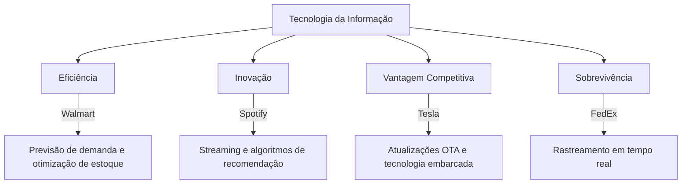
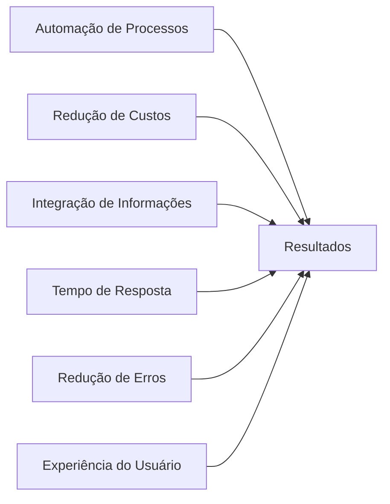

# 📊 Diagrama — Aula 03: Impacto da TI nos Negócios

## Dimensões do Impacto da TI

```mermaid
flowchart TD
    TI[Tecnologia da Informação] --> EF[Eficiência]
    TI --> IN[Inovação]
    TI --> VC[Vantagem Competitiva]
    TI --> SOB[Sobrevivência]

    EF --> |Walmart| EF1[Previsão de demanda e otimização de estoque]
    IN --> |Spotify| IN1[Streaming e algoritmos de recomendação]
    VC --> |Tesla| VC1[Atualizações OTA e tecnologia embarcada]
    SOB --> |FedEx| SOB1[Rastreamento em tempo real]
```

## TI como Fator de Eficiência

```mermaid
graph LR
    A[Automação de Processos] --> R[Resultados]
    B[Redução de Custos] --> R
    C[Integração de Informações] --> R
    D[Tempo de Resposta] --> R
    E[Redução de Erros] --> R
    F[Experiência do Usuário] --> R
```
