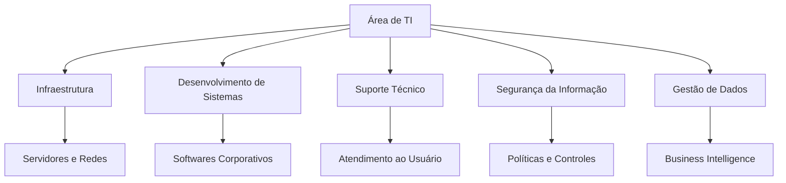
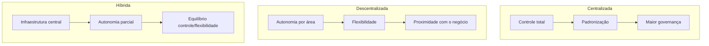
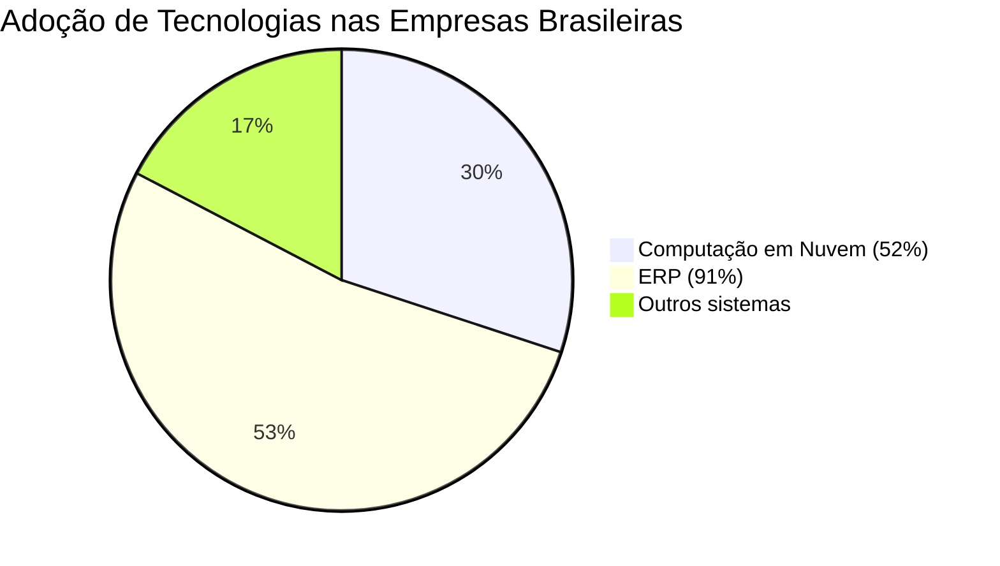

# 📊 Diagrama — Aula 04: TI nas Organizações

## Estrutura da Área de TI

```mermaid
flowchart TD
    TI[Área de TI] --> INF[Infraestrutura]
    TI --> DEV[Desenvolvimento de Sistemas]
    TI --> SUP[Suporte Técnico]
    TI --> SEG[Segurança da Informação]
    TI --> GD[Gestão de Dados]

    INF --> SRV[Servidores e Redes]
    DEV --> SOFT[Softwares Corporativos]
    SUP --> USR[Atendimento ao Usuário]
    SEG --> POL[Políticas e Controles]
    GD --> BI[Business Intelligence]
```

## Modelos de Organização da TI

```mermaid
graph TD
    subgraph Centralizada
        C1[Controle total] --> C2[Padronização]
        C2 --> C3[Maior governança]
    end

    subgraph Descentralizada
        D1[Autonomia por área] --> D2[Flexibilidade]
        D2 --> D3[Proximidade com o negócio]
    end

    subgraph Híbrida
        H1[Infraestrutura central] --> H2[Autonomia parcial]
        H2 --> H3[Equilíbrio controle/flexibilidade]
    end
```

## Indicadores da Pesquisa FGV (2024)

```mermaid
pie title Adoção de Tecnologias nas Empresas Brasileiras
    "Computação em Nuvem (52%)" : 52
    "ERP (91%)" : 91
    "Outros sistemas" : 30
```
