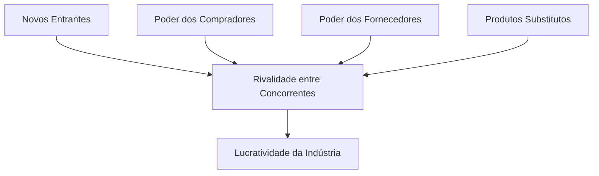
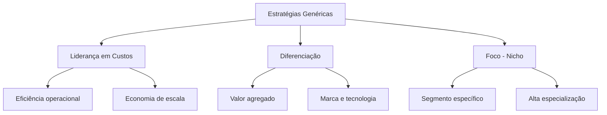
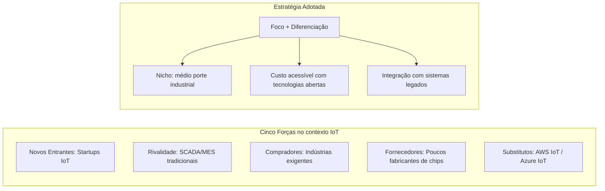

# 📊 Diagrama — Aula 05: Estratégia Competitiva (Porter)

## Cinco Forças Competitivas de Porter

```mermaid
flowchart TD
    RC[Rivalidade entre Concorrentes]
    NE[Novos Entrantes] --> RC
    PC[Poder dos Compradores] --> RC
    PF[Poder dos Fornecedores] --> RC
    PS[Produtos Substitutos] --> RC
    RC --> LUC[Lucratividade da Indústria]
```

## Estratégias Genéricas de Porter

```mermaid
graph TD
    EG[Estratégias Genéricas]
    EG --> LC[Liderança em Custos]
    EG --> DIF[Diferenciação]
    EG --> FOC[Foco - Nicho]

    LC --> LC1[Eficiência operacional]
    LC --> LC2[Economia de escala]
    DIF --> DIF1[Valor agregado]
    DIF --> DIF2[Marca e tecnologia]
    FOC --> FOC1[Segmento específico]
    FOC --> FOC2[Alta especialização]
```

## Aplicação ao Projeto Integrador

```mermaid
flowchart LR
    subgraph Cinco Forças no contexto IoT
        NE2[Novos Entrantes: Startups IoT]
        RV2[Rivalidade: SCADA/MES tradicionais]
        PC2[Compradores: Indústrias exigentes]
        PF2[Fornecedores: Poucos fabricantes de chips]
        PS2[Substitutos: AWS IoT / Azure IoT]
    end

    subgraph Estratégia Adotada
        EST[Foco + Diferenciação]
        EST --> N1[Nicho: médio porte industrial]
        EST --> N2[Custo acessível com tecnologias abertas]
        EST --> N3[Integração com sistemas legados]
    end
```
