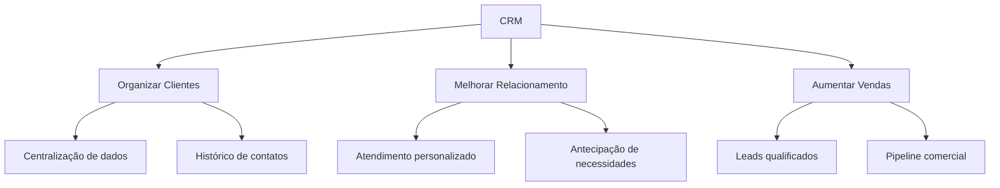
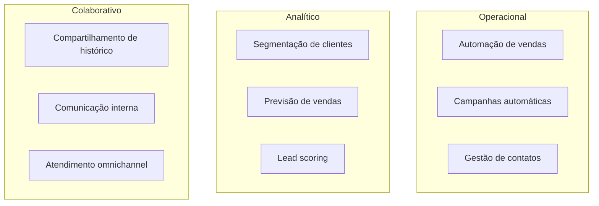
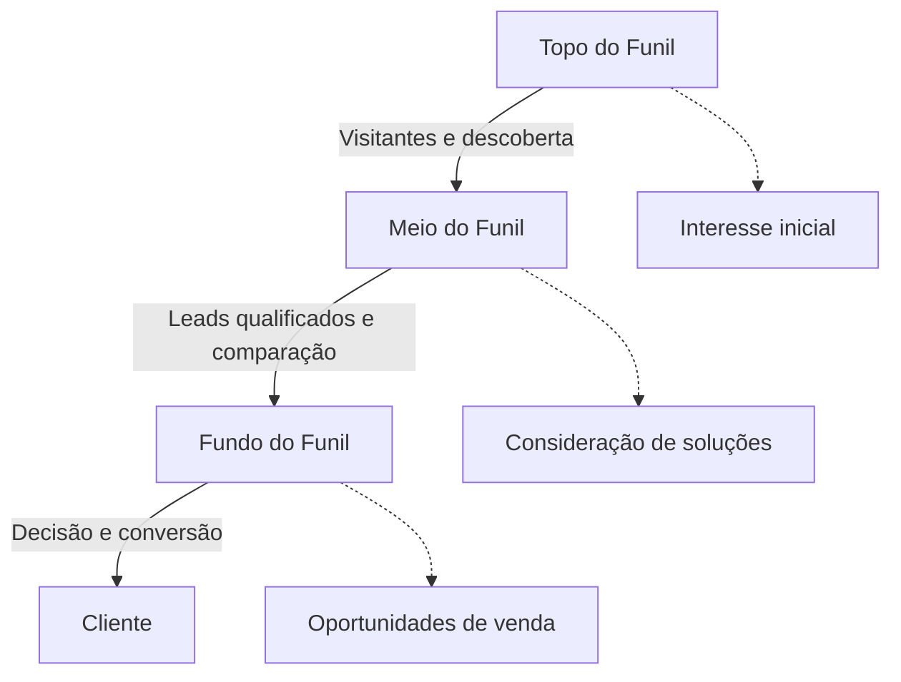
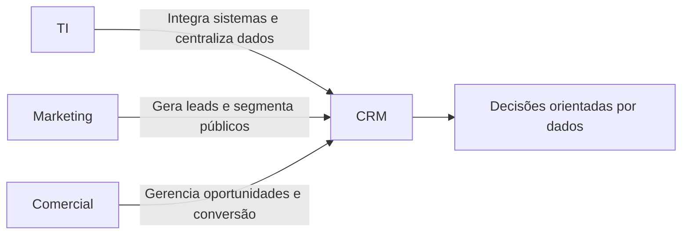

# 📊 Diagrama — Aula 06: CRM (Customer Relationship Management)

## Objetivos do CRM nas Organizações

```mermaid
flowchart TD
    CRM[CRM] --> ORG[Organizar Clientes]
    CRM --> REL[Melhorar Relacionamento]
    CRM --> VEN[Aumentar Vendas]

    ORG --> ORG1[Centralização de dados]
    ORG --> ORG2[Histórico de contatos]
    REL --> REL1[Atendimento personalizado]
    REL --> REL2[Antecipação de necessidades]
    VEN --> VEN1[Leads qualificados]
    VEN --> VEN2[Pipeline comercial]
```

## Tipos de CRM

```mermaid
graph TD
    subgraph Operacional
        OP1[Automação de vendas]
        OP2[Campanhas automáticas]
        OP3[Gestão de contatos]
    end

    subgraph Analítico
        AN1[Segmentação de clientes]
        AN2[Previsão de vendas]
        AN3[Lead scoring]
    end

    subgraph Colaborativo
        CO1[Compartilhamento de histórico]
        CO2[Comunicação interna]
        CO3[Atendimento omnichannel]
    end
```

## Funil de Vendas

```mermaid
flowchart TD
    TOPO[Topo do Funil] --> |Visitantes e descoberta| MEIO[Meio do Funil]
    MEIO --> |Leads qualificados e comparação| FUNDO[Fundo do Funil]
    FUNDO --> |Decisão e conversão| CLIENTE[Cliente]

    TOPO -.-> M1[Interesse inicial]
    MEIO -.-> M2[Consideração de soluções]
    FUNDO -.-> M3[Oportunidades de venda]
```

## Integração TI, Marketing e Comercial

```mermaid
graph LR
    TI[TI] --> |Integra sistemas e centraliza dados| CRM[CRM]
    MKT[Marketing] --> |Gera leads e segmenta públicos| CRM
    COM[Comercial] --> |Gerencia oportunidades e conversão| CRM
    CRM --> RES[Decisões orientadas por dados]
```
